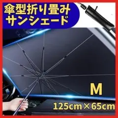
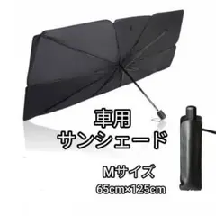
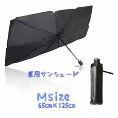
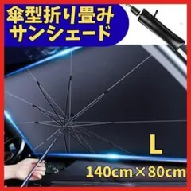
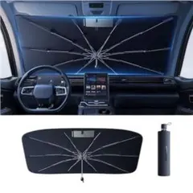

# 同一商品判定: サイズ表記がゆれていても同じ実寸なら同一商品

**判定結果**: 同一商品として扱う (A・B・C は同一商品。色違い・別サイズは別商品)

同じ「傘型折りたたみサンシェード (黒・約 125×65cm)」が、出品者ごとの **サイズ表記のゆれ** (`125cm×65cm` / `Mサイズ` / `M`) で別クラスタに分かれてしまった実例。実体 (黒・傘型・約 125×65cm・収納袋付き) が同じなら、表記が違っても同一商品として扱う。

---

## 商品 A (出品者 315138110、クラスタ カーケア用品_サンシェード_005)

| 項目 | 値 |
|---|---|
| タイトル | 車用サンシェード 125cm×65cm 傘型 折り畳み式 収納ポーチ 遮光 |
| 商品ページ | <https://jp.mercari.com/item/m51671971876> |
| 価格 | ¥850 |
| 出品者 ID | 315138110 |
| 実体 | 黒・傘型折りたたみ・収納袋付き |
| **サイズ表記** | **125cm×65cm** (サイズ記号なし) |

---

## 商品 B (出品者 614692248、クラスタ カーケア用品_サンシェード_008)

| 項目 | 値 |
|---|---|
| タイトル | サンシェード 車用 日除け UVカット 傘型 折りたたみ 収納袋付き Mサイズ |
| 商品ページ | <https://jp.mercari.com/item/m32953478013> |
| 価格 | ¥850 |
| 出品者 ID | 614692248 |
| 実体 | 黒・傘型折りたたみ・収納袋付き |
| **サイズ表記** | **Mサイズ** (画像内に 65cm×125cm) |

---

## 商品 C (出品者 417825465、クラスタ カーケア用品_サンシェード_012)

| 項目 | 値 |
|---|---|
| タイトル | サンシェード 車用 日除け UVカット 傘型 断熱 コンパクト 暑さ対策 傘式 |
| 商品ページ | <https://jp.mercari.com/item/m61178438979> |
| 価格 | ¥880 |
| 出品者 ID | 417825465 |
| 実体 | 黒・傘型折りたたみ・収納袋付き |
| **サイズ表記** | **Msize** (画像内に 65cm×125cm) |

---

## 比較

| 項目 | 商品 A | 商品 B | 商品 C | 一致 |
|---|---|---|---|---|
| 商品カテゴリ | 傘型サンシェード | 傘型サンシェード | 傘型サンシェード | ○ |
| 実体 (色・形状) | 黒・傘型 | 黒・傘型 | 黒・傘型 | ○ |
| 実寸 | 125×65 | 65×125 | 65×125 | ○ (軸の書き順が違うだけ) |
| 用途 | 車フロント日除け | 同左 | 同左 | ○ |
| 価格 | ¥850 | ¥850 | ¥880 | ほぼ同じ |
| **サイズ表記** | **125cm×65cm** | **Mサイズ** | **M** | **✗ (表記だけ違う)** |
| 出品者 | 315138110 | 614692248 | 417825465 | ✗ |

サイズ「表記」だけが `125cm×65cm` / `Mサイズ` / `M` とゆれている。実寸 (約 125×65cm) は同じ。

---

## 判定: 同一商品として扱う

3 件とも黒・傘型・約 125×65cm・収納袋付きで実体が一致する。サイズ表記が `125cm×65cm` / `Mサイズ` / `M` とゆれているだけで、中身は同じ量産 OEM 品。複数の出品者が同じ商品を並行して売る典型パターン (→ [`別出品者でも同じ柄なら同一商品.md`](別出品者でも同じ柄なら同一商品.md))。仕入れ候補としては 1 行にまとめ、販売数は出品者をまたいで合算する。

### 判定の境界 (これらは別商品)

- **L サイズ (140×80cm) は別商品**: 同じ傘型シリーズでも実寸が 140×80cm のもの (例: <https://jp.mercari.com/item/m82359526714>、出品者 427895912) は明確に大きく、別サイズ = 別商品。サイズ「違い」は別商品のルール ([`サイズ違いは別商品.md`](サイズ違いは別商品.md)) は生きている。本例が言うのは「同じ実寸なのに表記だけ違う」ケースに限る。

  

- **色違い (ベージュ) は別商品**: 同じ傘型でもベージュ (例: DesertWest <https://jp.mercari.com/item/m13407616624>、出品者 559208565、¥1500) は色違い = 別商品 ([`色違いは別商品.md`](色違いは別商品.md))。クラスタ 012 はこのベージュと黒 M を 1 つに誤統合していた。色違いは分けること。

  

### この例の注釈

- **同型の取りこぼし**: 数量表記のゆれ (`2個` / `2個セット` / 空) で同一商品が分かれる事例が別タスク [`tasks/2026_05_08_02_quantity表記揺れによる同一商品取りこぼし対応.md`](../../../../tasks/2026_05_08_02_quantity表記揺れによる同一商品取りこぼし対応.md) にある。本例はその **サイズ軸版**。原因は同じで、第 6 段階 6-1 の 6 軸完全一致が表記ゆれを吸収できないこと。
- 出典: run `2026_05_15_10_00` のレポートで物販オーナーが「同一判定できていない」と指摘 (要修正 #16/#17/#18)。
