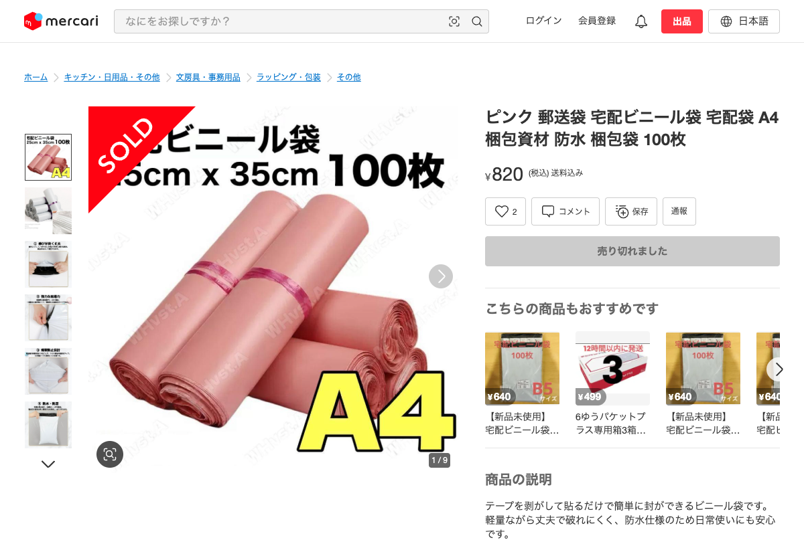

# 同一商品判定: サイズ違い

**判定結果**: 同一商品として扱わない (別商品、ただしサイズ別に内訳表示する)

---

## 商品 A

| 項目 | 値 |
|---|---|
| タイトル | ピンク 郵送袋 宅配ビニール袋 宅配袋 A4 梱包資材 防水 梱包袋 100枚 |
| 商品ページ | <https://jp.mercari.com/item/m37117138519> |
| 価格 | ¥820 |
| 出品者 ID | 940110103 |
| **サイズ** | **A4 (25 × 35 cm)** |
| 入り数 | 100 枚 |
| 色 | ピンク |
| 用途 | 配送用 |

---

## 商品 B

| 項目 | 値 |
|---|---|
| タイトル | 【白 B4 100枚】宅配ビニール袋 宅急便 梱包 テープ付 高品質 配送用 |
| 商品ページ | <https://jp.mercari.com/item/m82873229314> |
| 価格 | ¥890 |
| 出品者 ID | 132495190 |
| **サイズ** | **B4 (28 × 42 cm)** |
| 入り数 | 100 枚 |
| 色 | 白 |
| 用途 | 配送用 |

---

## 比較

| 項目 | 商品 A | 商品 B | 一致 |
|---|---|---|---|
| 商品カテゴリ | 宅配ビニール袋 | 宅配ビニール袋 | ○ |
| 入り数 | 100 枚 | 100 枚 | ○ |
| 用途 | 配送用 | 配送用 | ○ |
| **サイズ** | **A4** | **B4** | **✗** |
| 色 | ピンク | 白 | 違う (色違いも別商品要因) |
| 価格 | ¥820 | ¥890 | ほぼ同じ |

---

## 判定: 同一商品として扱わない (別商品)

サイズ (A4 vs B4) が違うため別商品として別行で集計する。ただし **同じ商品ファミリー (宅配ビニール袋 100 枚) のサイズ別バリエーション** として **レポートにはサイズ別の販売数を一覧表示したい** (A3=X 件、A4=Y 件、B4=Z 件 のような内訳)。これは「A4 も売れてるのでは?」という仕入れ判断のため。

### この例の注釈

本例は A4 と B4 に加えて色 (ピンク / 白) も違う。純粋な「サイズだけ違う」例としては、同じ色・同じ入り数で A4 / B4 が揃う 2 商品がより適切だが、現時点のメルカリ販売中商品で同じ出品者・同じ色・同じ入り数の例が見つからなかったためこの組合せで記録した。判定結論 (サイズ違いは別商品) は変わらない。
