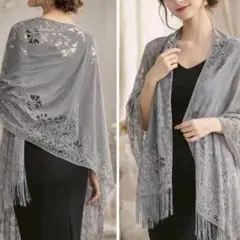
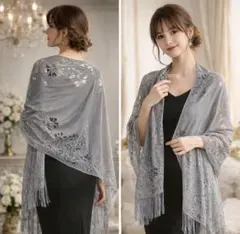

# 同一商品判定: サブカテゴリの付き方がゆれても実体が同じなら同一商品

**判定結果**: 同一商品として扱う

同じ「グレーのフリンジ付きレースショール」が、**サブカテゴリの付き方** (片方は空、片方は「ショール」) で別クラスタに分かれてしまった実例。色 (グレー)・柄 (花柄レース)・用途・価格が一致しており、実体は同じ商品。

---

## 商品 A (出品者 920693855、クラスタ ストール__006)

| 項目 | 値 |
|---|---|
| タイトル | 【G.Wセール】大判ストール 羽織り グレー 日焼け対策 冷房対策 着物 |
| 商品ページ | <https://jp.mercari.com/item/m24687246668> |
| 価格 | ¥980 |
| 出品者 ID | 920693855 |
| 色 | グレー |
| 柄 | 花柄レース・フリンジ付き |
| **サブカテゴリ (抽出値)** | **空** |

---

## 商品 B (出品者 246636561、クラスタ ストール_ショール_003)

| 項目 | 値 |
|---|---|
| タイトル | 上品レース 大判ストール グレー ショール 結婚式 パーティー 日焼け対策 |
| 商品ページ | <https://jp.mercari.com/item/m24608741985> |
| 価格 | ¥980 |
| 出品者 ID | 246636561 |
| 色 | グレー |
| 柄 | 花柄レース・フリンジ付き |
| **サブカテゴリ (抽出値)** | **ショール** |

---

## 比較

| 項目 | 商品 A | 商品 B | 一致 |
|---|---|---|---|
| カテゴリ | ストール | ストール | ○ |
| 実体 (色・柄・形状) | グレー・花柄レース・フリンジ | グレー・花柄レース・フリンジ | ○ |
| 用途 | 羽織り・日焼け/冷房対策・結婚式 | 同左 | ○ |
| 価格 | ¥980 | ¥980 | ○ |
| **サブカテゴリ (抽出値)** | **空** | **ショール** | **✗ (抽出のゆれ)** |
| 出品者 | 920693855 | 246636561 | ✗ |

タイトルの語句から「ショール」サブカテゴリが付くかどうかが出品者ごとにゆれ、片方だけ `ストール_ショール_*`、片方は `ストール__*` になった。実体は同じグレーのレースショール。

---

## 判定: 同一商品として扱う

色・柄 (花柄レース)・形状 (フリンジ付きショール)・用途・価格がすべて一致する。同じ量産 OEM 品を複数の出品者が売っている典型パターン (→ [`別出品者でも同じ柄なら同一商品.md`](別出品者でも同じ柄なら同一商品.md))。「ショール」というサブカテゴリが付くか付かないかは、タイトルの語句に「ショール」が入っているかどうかの差にすぎず、商品の中身は変わらない。仕入れ候補としては 1 行にまとめる。

### この例の注釈

- **同型の取りこぼし**: 第 6 段階 6-1 の 6 軸完全一致が、属性の表記・抽出のゆれを吸収できずに同一商品を別クラスタに割る問題。今回は **サブカテゴリ軸 (ショールの有無)**。
  - サイズ軸のゆれ版: [`サイズ表記ゆれは同一商品.md`](サイズ表記ゆれは同一商品.md) (M / 125×65 等)
  - 数量軸のゆれ版: [`tasks/2026_05_08_02_quantity表記揺れによる同一商品取りこぼし対応.md`](../../../../tasks/2026_05_08_02_quantity表記揺れによる同一商品取りこぼし対応.md)
- **色違いは依然として別商品**: 本例はあくまで「同じグレー同士」が分かれたケース。同じレースショールでもベージュ (例: <https://jp.mercari.com/item/m61093057581>) は色違いで別商品 ([`色違いは別商品.md`](色違いは別商品.md))。
- 出典: run `2026_05_15_10_00` のレポートで物販オーナーが「3つ上 (ストール__006) と同一商品」と指摘 (要修正 #19)。
