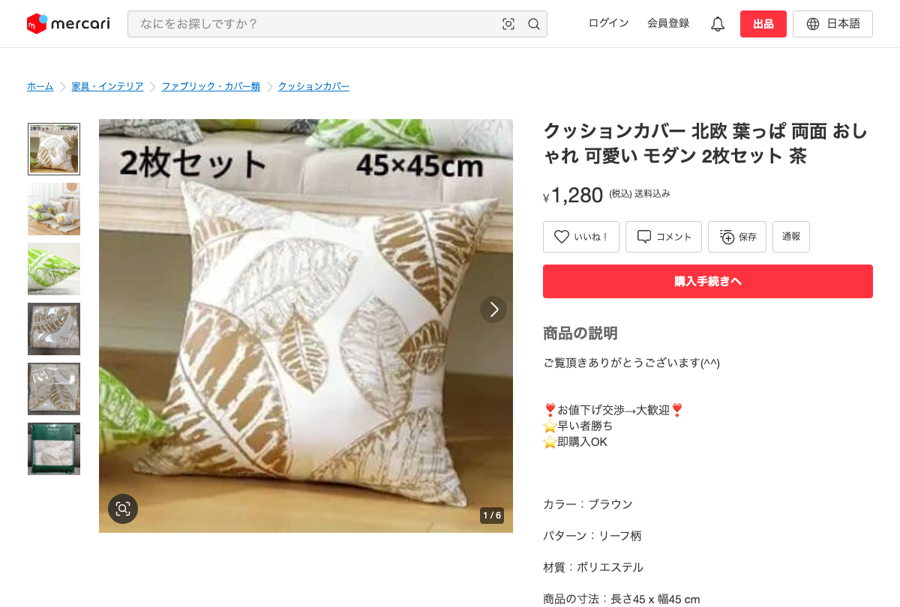

# 同一商品判定: セット枚数違い

**判定結果**: 同一商品として扱わない (別商品)

---

## 商品 A

| 項目 | 値 |
|---|---|
| タイトル | クッションカバー 北欧 葉っぱ 両面 おしゃれ 可愛い モダン 2枚セット 茶 |
| 商品ページ | <https://jp.mercari.com/item/m81135136898> |
| 価格 | ¥1,280 |
| 出品者 ID | 498540054 |
| サイズ | 約 45×45 cm |
| セット枚数 | **2 枚セット** |
| 柄 | 北欧 葉っぱ |
| 色 | 茶 |

---

## 商品 B

| 項目 | 値 |
|---|---|
| タイトル | クッションカバー 4枚セット 北欧 ボタニカル 45cm クッション |
| 商品ページ | <https://jp.mercari.com/item/m29936782656> |
| 価格 | ¥1,180 |
| 出品者 ID | 250319108 |
| サイズ | 45×45 cm |
| セット枚数 | **4 枚セット** |
| 柄 | 北欧 ボタニカル |

---

## 比較

| 項目 | 商品 A | 商品 B | 一致 |
|---|---|---|---|
| 商品カテゴリ | クッションカバー 北欧系 | クッションカバー 北欧系 | ○ |
| サイズ | 45×45 cm | 45×45 cm | ○ |
| **セット枚数** | **2 枚** | **4 枚** | **✗** |
| **柄** | **葉っぱ** | **ボタニカル** | **✗** |
| 価格 | ¥1,280 | ¥1,180 | ほぼ同じ |

---

## 判定: 同一商品として扱わない (別商品)

セット枚数 (2 枚 vs 4 枚) が違うため別商品。この例では柄も違うため、「セット枚数違い」と「柄違い」の両方のルールで別商品になる。

### 補足

同じ柄で 2 枚セット / 4 枚セットが併売されているケースを見つけたら、「セット枚数違い = 別商品」のルール単体が効く例として別 case を作る価値がある。ただしセット枚数違いの販売情報は **仕入れ判断の参考として合わせて表示** したい (セット数が多い方が利幅が大きい可能性があるため)。
