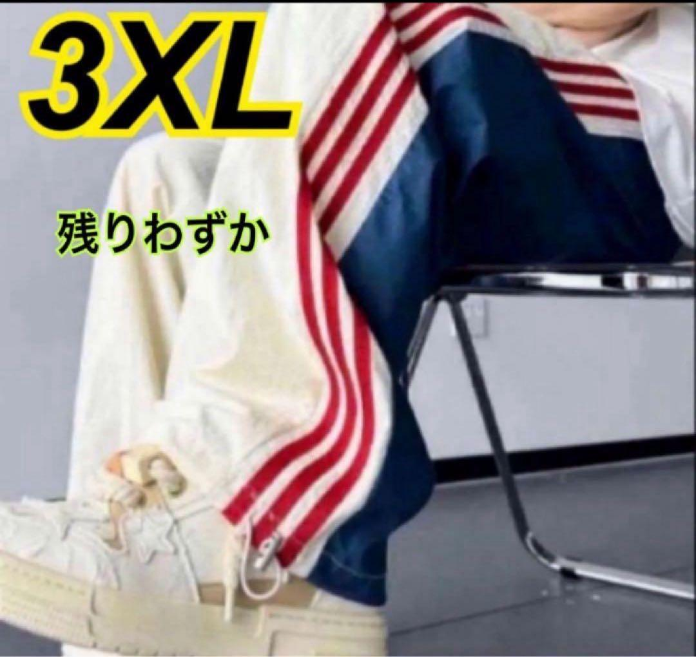
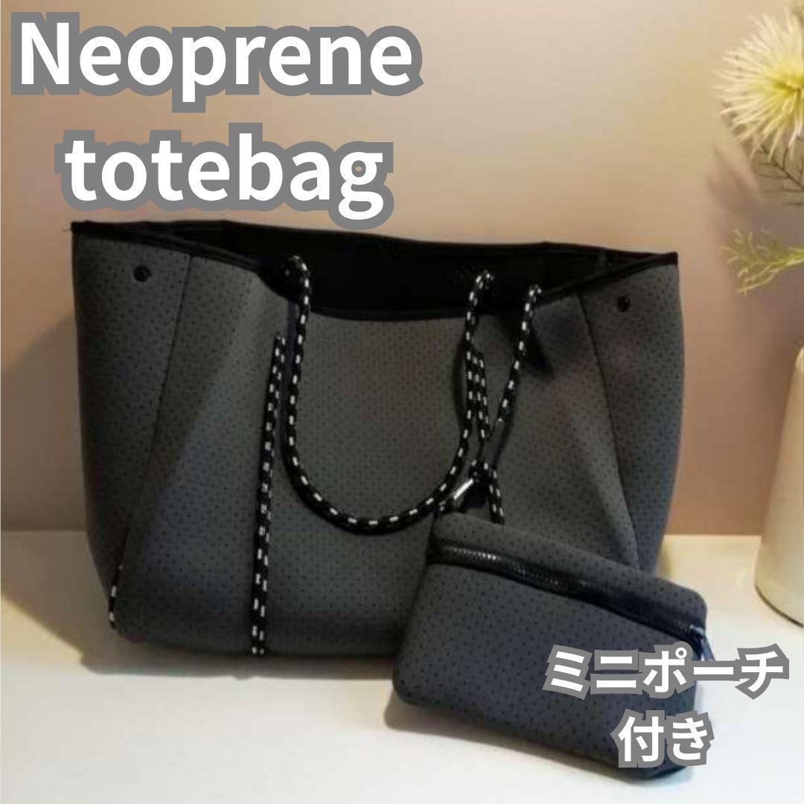
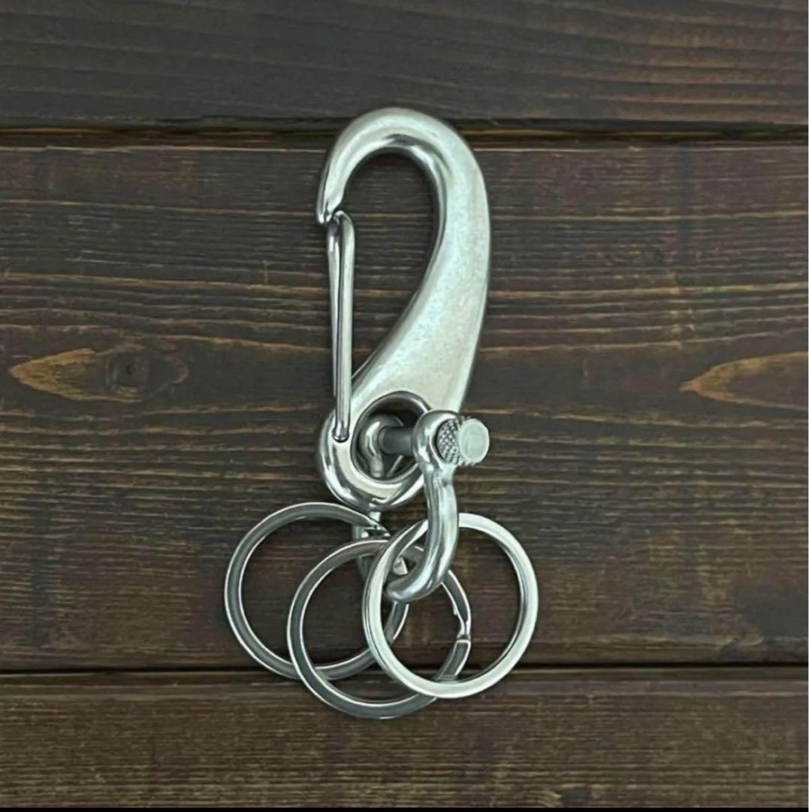

# 仕入れ候補判定: タイトルに無くても画像で模造品と判断

**判定結果**: 仕入れ候補として除外する

タイトル・商品説明にブランド名の文字列が無くても、画像にブランド連想デザイン (3 本ライン・特徴的な素材+形状・シグネチャーパーツ 等) が映っていれば、商標侵害または意匠連想で仕入れ候補から除外する。

---

## 例 1: 3 本ラインはアディダス模造

| 項目 | 値 |
|---|---|
| タイトル | 再入荷 即完売 トリコロールジャガーパンツ 3XL 大きいサイズ |
| 商品ページ | <https://jp.mercari.com/item/m70024120904> |
| 価格 | ¥2,880 |
| 出品者 | ラルフ |
| サイズ | 3XL (ウエスト 70〜106cm、着丈 110cm) |
| 色 | トリコロール (ホワイト系 + 赤 + 紺) |
| カテゴリ | メンズ > パンツ > ジョガーパンツ・スウェットパンツ |

**タイトル/商品説明の文字列**: `トリコロール` (一般語) / `ジャガーパンツ` (一般名詞、ジャガード織り) / `サイドラインで脚長効果` (商品説明) — `アディダス` / `adidas` 等のブランド名は**一切含まれない**。

**画像の判断根拠**: サイドに **赤 3 本ライン** (白地 + 紺配色)。アディダスの登録商標 "Three Stripes" と同一構造 (平行 3 本ライン)。アディダスロゴは無いが、3 本ライン自体が商標登録されているため、本数・配置で侵害成立。

**物販オーナーフィードバック (2026-04-16 データ No.71)**: 「ブランド侵害、アディダス」。

---

## 例 2: ネオプレーン穴あき+ロープハンドル+ミニポーチ付きはウィローベイ模造

| 項目 | 値 |
|---|---|
| タイトル | ネオプレーン 通勤 黒 通学 旅行 海 黒 ヨガ トートバッグ プール 大容量 |
| 商品ページ | <https://jp.mercari.com/item/m15821348809> |
| 価格 | ¥2,680 |
| 色 | グレー系 (商品説明では「黒 ブラック」) |
| カテゴリ | バッグ |

**タイトル/商品説明の文字列**: `ネオプレーン` (素材名、一般語) / `トートバッグ` (一般名詞) / `大容量` `通勤` `ヨガ` 等の用途語 — `ウィローベイ` / `Willow Bay` / `WILLOW BAY` 等のブランド名は**一切含まれない**。

**画像の判断根拠**: ネオプレーン穴あき素材 + 白黒ステッチ入りロープハンドル + 同素材ミニポーチ付属。この 3 点セットはオーストラリアのブランド **Willow Bay** の代表モデル (wb-1002 等) のシグネチャーデザイン。

**物販オーナーフィードバック (2026-04-16 データ No.18)**: 「ウィローベイ模造」 (参考 URL: https://nanaple.com/products/wb-1002)。

---

## 例 3: ネジ式シャックル+ヨット金具形状はウィチャード連想

| 項目 | 値 |
|---|---|
| タイトル | カラビナ 50mm ステンレス キーホルダー シルバー キーリング チェーン |
| 商品ページ | <https://jp.mercari.com/item/m23891174615> |
| 価格 | ¥850 |
| カテゴリ | 日用雑貨 |

**タイトル/商品説明の文字列**: `カラビナ` / `ステンレス` / `キーホルダー` / `キーリング` — 全て一般名詞。`ウィチャード` / `Wichard` 等のブランド名は**一切含まれない**。

**画像の判断根拠**: カラビナ下部に **ネジ式シャックル (U 字型ボルト)** が組み合わされている。このシャックルはフランスのマリン金具ブランド **Wichard** のヨット・ボート用金具がシグネチャー。中国輸入の安価ステンレスカラビナでこの形状を採用するのは意匠模倣の疑い。

**物販オーナーフィードバック (2026-04-16 データ No.47)**: 「ハンドメイド品。おそらく中国輸入品を取り揃えて作っているもの。あと、ウィチャードというブランドがでてきた」 (物販オーナー本人も確信度は低い記述、補足例として記録)。

---

## 判定: 3 例とも仕入れ候補として除外する

共通構造:

1. タイトル文字列には NG 語なし
2. 画像に「ブランド連想デザイン」(3 本ライン / 特定素材+形状 / シグネチャーパーツ) が映っている
3. 物販オーナーは画像・素材・形状からブランド模造を認識

---

## この例集の注釈

### なぜ辞書で捕獲しないのか

- 一般名詞 (トリコロール / ネオプレーン / カラビナ 等) を辞書化すると他商品で誤爆リスク大
- 具体複合語 (「トリコロールジャガーパンツ」等) で今回データは捕獲できても、将来の別表記には無力
- 本質はタイトル外の**視覚的特徴検出**で、タイトル辞書の守備範囲外

### 対応フェーズ

`procedures/mercari-research-v2.md` の第 6 段階 identity_resolution_step (画像判定) 以降で対応する案件。

### 判断の強度

| 例 | 判断強度 | 根拠 |
|---|---|---|
| 例 1 (3 本ライン→アディダス) | 強 | 3 本ラインはアディダスの登録商標 |
| 例 2 (ネオプレーン穴+ロープ→ウィローベイ) | 中〜強 | 3 点セットのシグネチャーデザイン一致、参考 URL あり |
| 例 3 (シャックル→ウィチャード) | 弱〜中 | 物販オーナー本人も「おそらく」と確信度低い、意匠模倣の疑い止まり |
