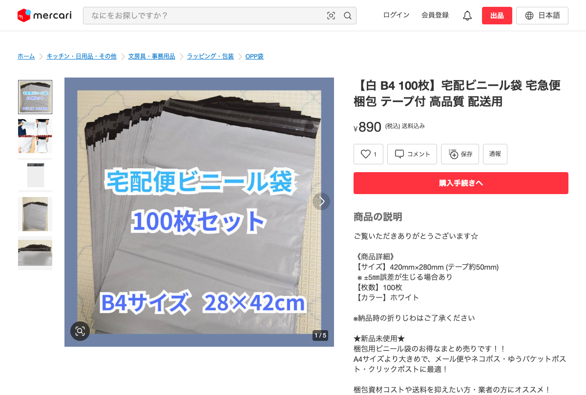
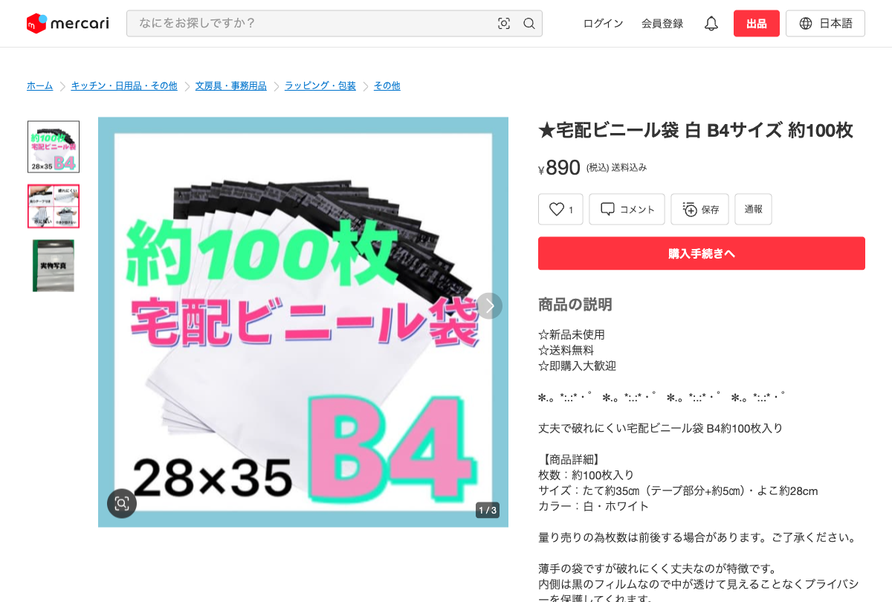

# 同一商品判定: 別出品者でも仕様・柄が一致すれば同一商品

**判定結果**: 同一商品として扱う

---

## 商品 A (出品者 132495190)

| 項目 | 値 |
|---|---|
| タイトル | 【白 B4 100枚】宅配ビニール袋 宅急便 梱包 テープ付 高品質 配送用 |
| 商品ページ | <https://jp.mercari.com/item/m82873229314> |
| 価格 | ¥890 |
| 出品者 ID | 132495190 |
| サイズ | B4 (28 × 42 cm) |
| 入り数 | 100 枚 |
| 色 | 白 |
| 用途 | 配送用 |

---

## 商品 B (出品者 846330263)

| 項目 | 値 |
|---|---|
| タイトル | ★宅配ビニール袋 白 B4サイズ 約100枚 |
| 商品ページ | <https://jp.mercari.com/item/m46550090916> |
| 価格 | ¥890 |
| 出品者 ID | 846330263 |
| サイズ | B4 (28 × 35 cm) |
| 入り数 | 約 100 枚 |
| 色 | 白 |
| 用途 | 配送用 |

---

## 比較

| 項目 | 商品 A | 商品 B | 一致 |
|---|---|---|---|
| 商品カテゴリ | 宅配ビニール袋 | 宅配ビニール袋 | ○ |
| サイズ規格 | B4 (28×42cm) | B4 (28×35cm) | ほぼ同じ (B4 規格の外寸微差) |
| 入り数 | 100 枚 | 約 100 枚 | ○ |
| 色 | 白 | 白 | ○ |
| 用途 | 配送用 | 配送用 | ○ |
| 価格 | ¥890 | ¥890 | ○ |
| **出品者** | **132495190** | **846330263** | **✗** |

出品者だけが違う。仕様・色・用途・価格はすべて一致 (サイズ表記の外寸微差は B4 規格の許容範囲)。

---

## 判定: 同一商品として扱う

出品者は違うが、サイズ・入り数・色・用途・価格・柄 (無地白) のすべてが一致している。複数の出品者が同じ OEM 品を並行輸入して販売している典型パターン。仕入れ候補としては 1 行にまとめ、販売数は出品者をまたいで合算する (出品者数も記録して、市場の需要度を把握する)。

### 判定の境界

- 柄が違うなら別商品 (柄違いは別商品)
- サイズ規格が違うなら別商品 (サイズ違いは別商品)
- 色が違うなら別商品 (色違いは別商品)
- 価格が 2 倍以上違うなら別商品
- **これら属性がすべて一致なら、出品者が違っても同一商品**

### サイズ表記の微差について

商品 A は 28×42cm、商品 B は 28×35cm で 7cm の差がある。袋の外寸として違うが、**中身に入れる B4 用紙規格 (257×364mm)** はどちらも入る。袋に持たせる余裕の取り方が OEM ごとに違う程度の違い。量産品の規格誤差範囲として同一商品とみなす。
