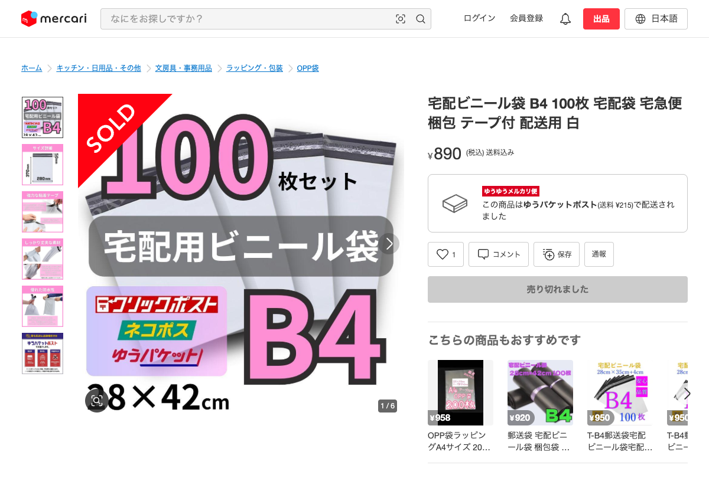
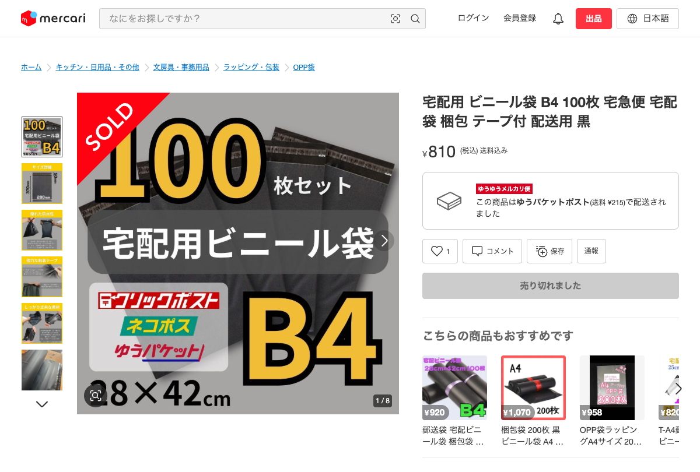

# 同一商品判定: 色違い

**判定結果**: 同一商品として扱わない (別商品)

---

## 商品 A

| 項目 | 値 |
|---|---|
| タイトル | 宅配ビニール袋 B4 100枚 宅配袋 宅急便 梱包 テープ付 配送用 白 |
| 商品ページ | <https://jp.mercari.com/item/m94373037394> |
| 価格 | ¥890 |
| 出品者 ID | 159086186 |
| サイズ | B4 (28 × 42 cm) |
| 入り数 | 100 枚 |
| 色 | 白 |

---

## 商品 B

| 項目 | 値 |
|---|---|
| タイトル | 宅配用 ビニール袋 B4 100枚 宅急便 宅配袋 梱包 テープ付 配送用 黒 |
| 商品ページ | <https://jp.mercari.com/item/m82941035239> |
| 価格 | ¥810 |
| 出品者 ID | 159086186 (商品 A と同一出品者) |
| サイズ | B4 (28 × 42 cm) |
| 入り数 | 100 枚 |
| 色 | 黒 |

---

## 比較

| 項目 | 商品 A | 商品 B | 一致 |
|---|---|---|---|
| サイズ | B4 28×42cm | B4 28×42cm | ○ |
| 入り数 | 100 枚 | 100 枚 | ○ |
| 用途 | 配送用 | 配送用 | ○ |
| テープ | あり | あり | ○ |
| 出品者 | 159086186 | 159086186 | ○ |
| **色** | **白** | **黒** | **✗** |
| 価格 | ¥890 | ¥810 | ほぼ同じ |

**色以外の属性はすべて一致している**。

---

## 判定: 同一商品として扱わない (別商品)

色 (白 / 黒) が違うため、別商品として別々に集計する。他の属性が一致していても、色が違えば別商品とみなす。

---

## この例の注釈

商品 A のタイトルは「宅配**ビニール袋**」、商品 B は「宅配**用 ビニール袋**」で、単語区切りが微妙に違う。色違いだけを示す純粋な例としては、完全に同じタイトル表記で色だけ違う 2 商品が理想。本例は「人間が見れば同一カテゴリと判断できる」レベルの微差と判断して採用している。タイトル表記ゆれを同一商品として扱えるかの判定は別の例で扱う (本例の判定基準には含めない)。
